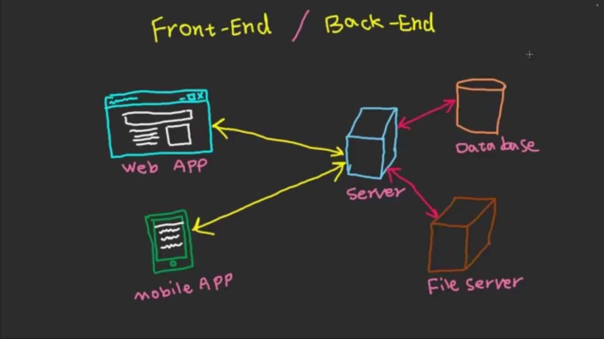

# Node.js

***what is the difference between Front-End vs Back-End vs database***


download: Node js:  https://nodejs.org/dist/v20.16.0/node-v20.16.0-x64.msi

run : ``` node index.js``` in the terminal


***modules***

**1.Local**

### some of important local mmodule

***os modue:***
https://nodejs.org/api/os.html

***path modue:***

https://nodejs.org/api/path.html

***fs modue:***
https://nodejs.org/api/fs.html


**2.in-build**

**3.imported/external**


 ***single threated / sync***

## Event Loop in Node.js 


REPL=> **Read Execute Print Loop**


